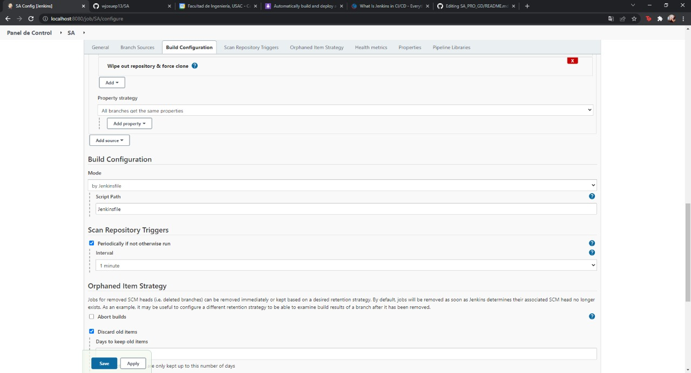
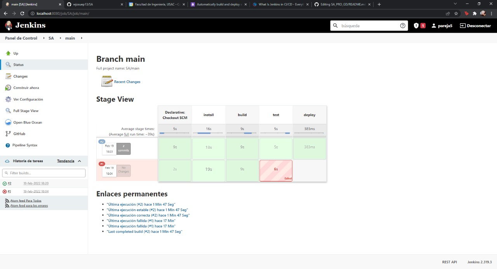

# Practica 3

## Pruebas unitarias
Utilizando el frontend creado anteriormente en la practica 2, se creo una prueba unitaria.

Se agrega el paquete ***@vue/test-utils*** y luego se creo la carpeta tests/unit dentro de la carpeta de frontend donde se alojaran los archivos de prueba.

La funcion describe contiene el nombre de la prueba y por cada test se valida un caso de prueba para el componente.

## Integracion Continua

Se inicio instalando jenkins de manera local siguiente el siguiendo tutorial <https://www.jenkins.io/doc/book/installing/windows/>

Una vez que jenkins esta instalado y se haya creado un usuario administrador. Se creo un job multi branch, seleccionando en la fuente de codigo que es un proyecto de github y marcando un scan trigger de un minuto.

Luego se crearon los siguientes stages:
- Install
- Build
- Test
- Deploy

Donde se instalan las dependencias necesarias, luego se contruye el proyecto, luego se ejecutan las pruebas unitarias y finalmente se ejecuta el despligue si se trata de la rama main.

## Video

<https://youtu.be/g4I6xOUXz64>